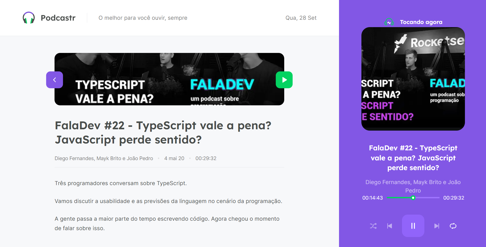

<p align="center">
   
</p>

<div align="center">
 <a href="#projeto">Projeto</a> •
 <a href="#tecnologias">Tecnologias Utilizadas</a> •
 <a href="#execucao">Como Executar</a> •
 <a href="#documentacao">Documentação</a> •
 <a href="#construcao">Em Construção</a> •
 <a href="#licenca">Licença</a> •
 <a href="#autor">Autor</a> •
 <a href="#contato">Contato</a>
</div>

---

# :fire: Obrigado por visualizar este repositório 

<p align="justify"> Olá, primeiramente me chamo Gabriel Kenji Poli Ozaki, tenho 21 anos e trabalho na área de Desenvolvedor Front-end. </p>

<p align="justify"> Para mais informações sobre mim, acesse o README em meu perfil do GITHUB.</p>

## :computer: <strong id="projeto">Sobre o Projeto </strong>




<p align="justify">O <strong>Podcastr</strong> é uma aplicação volta à <strong>exibição e reprodução de episódios podcast</strong>. Permitindo que o usuário tenha um acesso único a listagem dos episódios, através deste Website.</p>

<p align="justify">Essa aplicação Podcastr foi desenvolvida, através de um evento gratuito feito pela empresa Rocketseat.</p>

<span> TAGs: #missaoespacial | #embuscadoproximonivel | #astronautas | #universoinfinito | #missaocumprida </span>

### :pushpin: Funcionalidades

- [x] Destaque de dois últimos lançamentos
- [x] Listagem de todos episódios
- [x] Reproduzir o episódio desejado
- [x] Exibição do conteúdo do episódio + opção de reprodução

### :triangular_ruler: Layout

<p>Você pode visualizar o layout do projeto, através desse<a href="https://www.figma.com/file/UwFEntsHpHYJlHNQAQr4gA/Podcastr/duplicate"> link</a>. É necessário ter conta no <a href="https://www.figma.com/">Figma</a> para acessá-lo.</p>

## :rocket: <Strong id="tecnologias"> Tecnologias Utilizadas </Strong>

[](https://nextjs.org/) [](https://www.typescriptlang.org/) [](https://sass-lang.com/)

## :runner: <strong id="execucao"> Como executar o projeto </strong>

[](https://classic.yarnpkg.com/en/docs/install/#windows-stable)

```bash
# Fazer o clone do Repositório.
>> git clone https://github.com/WD-GabrielKenji/NLW5-Podcastr.git
>> cd NLW5-Podcastr >> code .
```

```bash
# Para executar a aplicação é necessário:

## Instalar as dependências:
>> yarn
## Iniciar a API Fake:
>> yarn server
## Iniciar o servidor de desenvolvimento:
>> yarn dev
```

<pre>
>> Acessar <a href="http://localhost:3000" rel="nofollow"><code>localhost:3000</code></a> no seu Browser, e usufruir da aplicação!
</pre>

## :book: <strong id="documentacao"> Documentação </strong>

<details>
<summary>
  Documentação com os detalhes técnicos do projeto...
</summary>

<br>
<h2>Conceitos e praticas utilizados no desenvolvimento:</h2>

<p align="justify">Utilizamos os conceitos do React de Componentes, Fragment, Propriedades e Estados na criação e comunicação de informações em eles.</p>

<p align="justify">TypeScript serve para utilizar uma linguagem de tipagem, dando um formato ou parâmetros aos dados que estão sendo recebidos, ou seja, podemos assim saber os dados presentes dentro de uma variável ou os dados que uma função necessita receber, o que facilitaria o entendimento e principalmente na necessidade de uma manutenção do código.</p>

<p align="justify">O framework NextJS que é um framework por cima do React irá diminuir as responsabilidades do Back-end e ajudará na criação das interfaces da aplicação com o conceito SSG (Static Site Generation), fazendo o fluxo de forma totalmente automatizada, onde determinamos um tempo para ela seja atualizada e após esse tempo o NextJS irá carregá-la com o novo conteúdo.</p>

<p align="justify">Desenvolvemos para esta aplicação, o conceito de SSG, para que ela seja gerada de forma estática (SSG), trazendo assim, mais performance e uma melhor experiência para o usuário.</p>

<p align="justify">O conceito SSG, foi utilizado nesta aplicação, pois como os conteúdos dos episódios podcasts, contém, para ambos os usuários, os mesmos detalhes para cada episódio, sendo somente alterado a lista dos episódios a cada lançamento, em um determinado período (determinado dentro do “getStaticProps”). Assim, não há necessidade de ser feita várias requisições ao Back-end, para obter os mesmos conteúdos e também para melhorar a indexação nas paginas da aplicação (SEO), pois assim que os conteúdos forem carregados na primeira requisição feita, o conteúdo da página ficará disponível para qualquer mecanismo de busca ou Crawlers que vierem buscar as informações desejadas, até mesmo se alguns deles estiverem com o JavaScript desabilitado.</p>

<p align="justify">Junto com o conceito SSG, foi utilizado o conceito de Incremental Static Regeneration, que podemos fazer especificações dos conteúdos que devem ser gerados estaticamente junto com o build/requisição da página.</p>

<h2><strong>Ferramentas e Bibliotecas utilizadas no desenvolvimento:</strong></h2>

<p align="justify">A ferramenta JSON Server é muito boa, para simular uma API Fake, principalmente quando estamos desenvolvendo o Front-end e ainda não temos um API pronto para uso.  Essa ferramenta irá converter um arquivo JSON e transformá-la em uma API com listagem, filtro, relacionamento, paginação, criação, update, delete, para assim ir criando o projeto já consumindo uma API.</p>

<p align="justify">A ferramenta SASS/SCSS é um pré-processador CSS que permite escrever CSS de uma maneira diferente, onde podemos utilizar diversas funcionalidades que esta ferramenta oferece, por exemplo, o encadeamento de elementos dentro de um elemento pai.</p>

<p align="justify">A biblioteca Axios para fazer requisições HTTP, que traz algumas funcionalidades, que são o entendimento pelo padrão do JSON e configuração de um baseURL (caminho URL padrão), assim só será necessário fazer a chamada da rota(s) com seu(s) parâmetro(s).</p>

<h2><strong>BÔNUS:</strong></h2>

<details>
<p align="justify"> <strong>O deploy</strong> foi feito da maneira mais pratica, onde utilizamos um serviço de deploy especializados para aplicações Front-end, chamado <strong>“Vercel”</strong> e seguimos a seguintes etapas para concluir o deploy: </p>

```bash
# Crie uma conta no site da Vercel:
>> https://vercel.com/

# Baixar o CLI Vercel pelo npm na aplicação:
>> npm i -g vercel

# Verificar se está disponível o CLI Vercel:
>> vercel -h

# Fazendo o login (Siga os passos apresentados):
>> vercel login

# Preparando o deploy da aplicação (Responda e siga os passos apresentados):
>> vercel
```

</details>

</details>

## :construction: <strong id="construcao"> Em construção </strong>

Funcionalidades que ainda estão sendo preparadas para serem incrementadas:

<ul>
  <li> Responsividade </li>
  <li> Tema Dark </li>
  <li> Adaptação para Mobile </li>
  <li> Funcionalidade PWA </li>
</ul>

## :closed_book: <strong id="licenca"> Licença </strong>


Esse projeto está sob a licença MIT. Veja o arquivo [LICENSE](LICENSE) para mais detalhes.

## :boy: <strong id="autor"> Autor </strong>

<a href="https://github.com/WD-GabrielKenji" title="Perfil Github">
  
  <br />
  <sub><b>Gabriel Kenji Poli Ozaki</b></sub> :star2: 
</a>

Feito de ❤️ por <strong>Gabriel Kenji Poli Ozaki</strong> - <strong>Desenvolvedor Front-end</strong> 👋🏽

### :mailbox_with_mail: <strong id="contato"> Redes Sociais para Contato: </strong>

<p> Entre em contato, através destas redes sociais: </p>

[](https://www.linkedin.com/in/wdkenji/) :boom: [](https://www.instagram.com/biel.kenjii/) :boom: [](mailto:g.kenjijs@gmail.com)

[](https://github.com/WD-GabrielKenji)